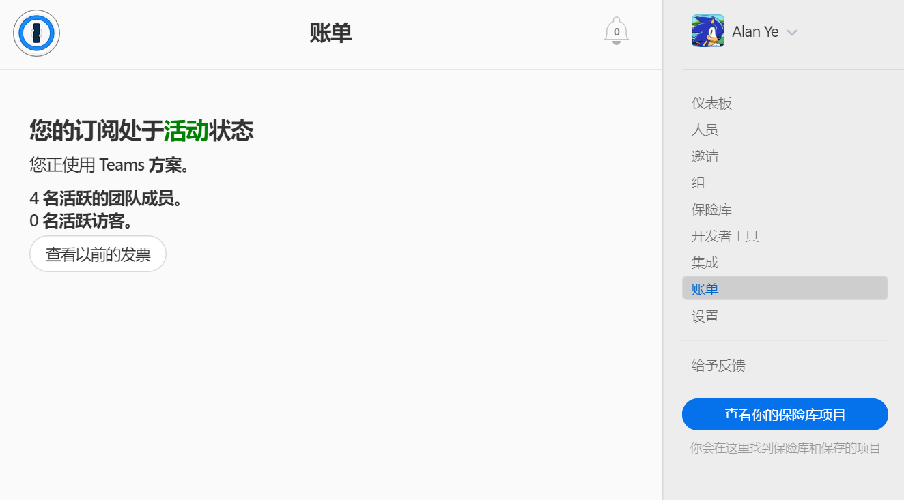
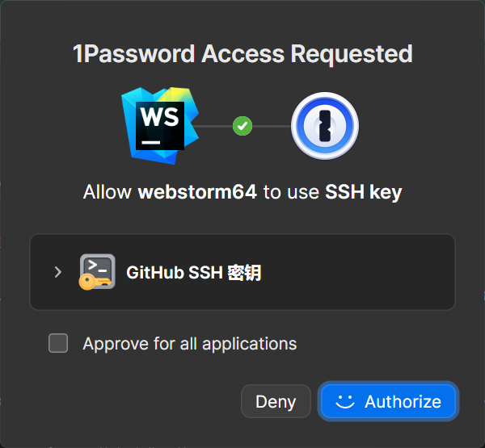
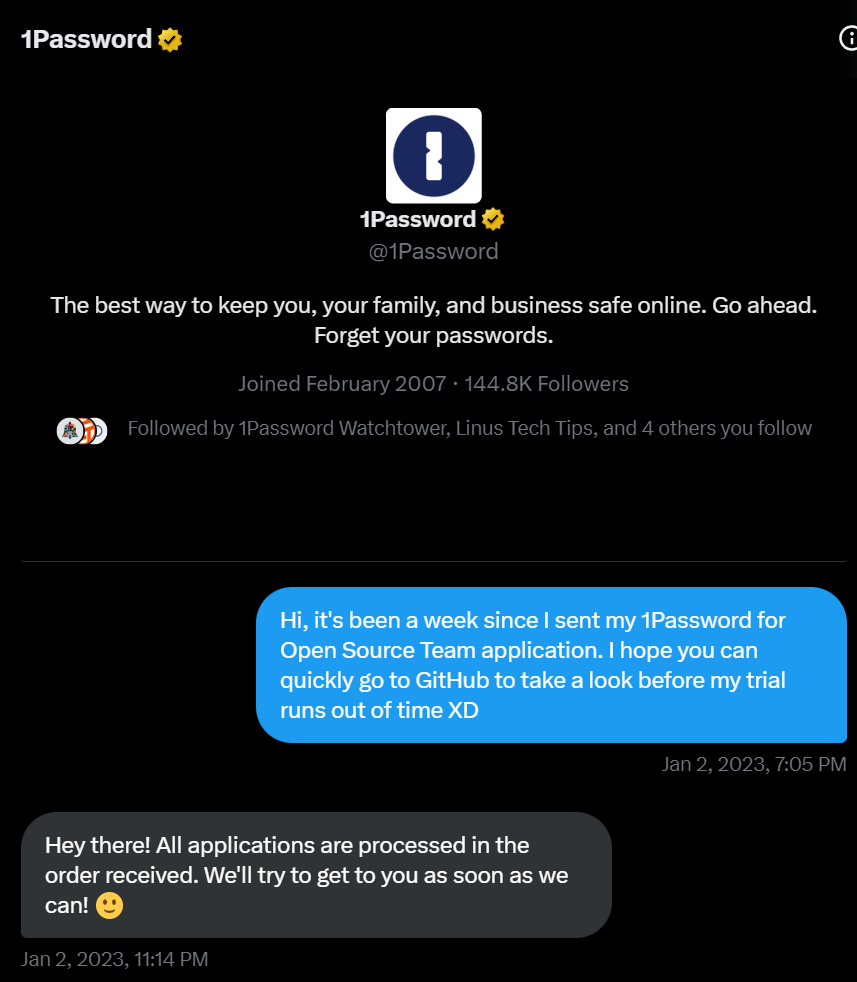

## Table of contents

## 写在开头

当今，大部分平台已逐步从“一次性买断”过渡到“订阅制”，1Password 8 也是如此。公司为了维持经营、继续发展做出此番举动也并非不可理解。

截止至 2024 年 1 月，1Password 8 个人版每年收费 USD $35.88，Teams 基础版 (10 人) 每年收费 USD $239.4。


而只要你申请通过了 1Password for Open Source Project，你就可以免费获得**永久**的 1Password for Teams 订阅，这实在是太良心了。

当你看到 1Password for Open Source 的 [GitHub 页面](https://github.com/1Password/1password-teams-open-source)上所写的这段话便可了解他们的意图。

> It's fair to say that 1Password wouldn't exist without the open source community, so we want to give back and help teams be more productive and secure.
>
> _说实话，1Password 的出现根本离不开开源的社群，因此我们决定回馈并帮助那些开源团队变得更加高效且安全。_

## 申请要求

1Password 对于开源项目的要求其实并不严格

你需要符合以下其一要求：

- 你是一个已创建至少 30 天且活跃的开源项目的核心贡献者
- 你是一个开源社区见面会/活动/会议的组织者

另外，你的项目必须：

- 使用标准开源许可证
- 非商业性质

## 申请流程

1. 创建 1Password Teams 账户
   - 前往[注册链接](https://start.1password.com/signup/?t=B)，填写注册信息
   - 注册之后你会发现此时账户处于试用状态，不必担心
2. 邀请至少一位其他用户加入团队的拥有者用户组 (Owners group)
3. Fork 这个 [GitHub Repo](https://github.com/1Password/1password-teams-open-source) 并在 `Open source projects using 1Password Teams` 部分底部填入有关开源项目的信息

```markdown
### Project name

A short description of what we do.
https://myawesomeproject.org
```

4. 使用模板向原 Repo 提交一个 PR 并附上你的信息

## 申请完成后

前往团队管理界面 > 账单，你将不会再看到任何有关 `到期` 相关的字样。



1Password Team 的所有者看不到其他用户的私有数据，但是可以在 Shared 共享保险箱中与他人共享项目，除此之外与 1Password 个人版并无太大差异。

但是你需要注意: 该会员资格不得被转让或出售，因此这个 1Password for Teams 的所有者只能是你；另外，如果你的开源项目不再活跃，1Password 可能会收回你的会员资格。

## 1Password 好处都有什么?

- 支持 macOS, iOS, Windows, Android, Linux, 浏览器插件和命令行
- 可以生成 SSH Key 公私钥，并使用 1Password-CLI 将其用于 Git Commit 签名或其他自动化 Workflow
- 调用 1Password-CLI 或者电脑唤醒后可以通过 Windows Hello / Touch ID / Face ID 快速鉴权 (可能之后会支持 Vision Pro 的 Optic ID)，不过电脑重启后或长时间未登录需要强制手动输入主密码



- 相比于每个网站都使用类似的密码，使用 1Password 可以让你为每个网站都生成不同的密码，以防撞库导致其他网站密码同样泄露
- 相比在浏览器中保存密码，1Password 可以 _减少_ 因计算机被 Malware 潜入而导致账户密码被盗的情况
- 自建 Bitwarden Self Host 是一个不错的低成本方案，但是其存在诸多不稳定因素，一旦服务器宕机数据便无法访问。我个人认为 1Password 团队还是比我的运维技术更强的。🙃
- 其余的可能就需要你探索了...

## 我个人申请过程中的小插曲

我其实一年前就申请了这个项目，注册试用期间我眼看着就要到期了，但是我的 PR 还是没有人 Review，内心很慌。因此向 1Password 的 Twitter 账户发送了一条 DM。



1Password 社交媒体团队的回复还是很及时的，几小时内就看到了我的消息，很快便通过了我的申请。没想到我这种菜鸟的 Project 都能被 approved 🤣，实在是感谢 1Password。
