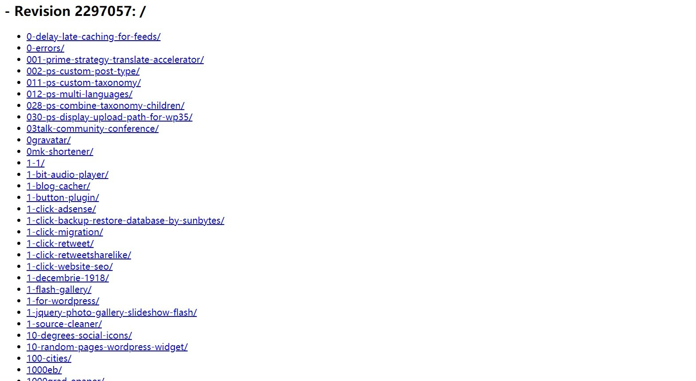
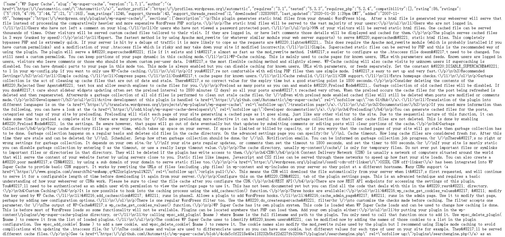

## 前言

最近在做 WP-China-Yes 插件商城的项目，其中就需要用 Python 爬 WordPress.org 上所有可翻译的项目。~~尽管还没找到如何筛选可翻译的项目...~~

## 准备

- Python 环境
- requests 模块
- BeautifulSoup 4 模块

## 步骤

WordPress.org 所有插件的 slug (永久链接) 都可以通过 http://plugins.svn.wordpress.org/ 得到：



```python
import requests

#通过 requests 模块获取 http://plugins.svn.wordpress.org 这个网页上的内容
html=requests.get("http://plugins.svn.wordpress.org/").text
```

所有插件的 json 信息都可以通过 https://api.wordpress.org/plugins/info/1.0/ 获取



```python
from bs4 import BeautifulSoup

#使用 BeautifulSoup 获取 WordPress.org 插件 json 内容
soup=BeautifulSoup(html,features="lxml")
lis=soup.find_all('li')
baseurl="https://api.wordpress.org/plugins/info/1.0/"
```

最后一步，输出为一个 txt 文件

```python
with open('all_plugins_urls.txt','a') as out:
    for a in soup.find_all('a', href=True):
        out.write(baseurl+a['href'].replace('/','')+".json"+"\n")
```

综上所述，整个 Python 爬虫代码应该是这样的

```python
import requests 
from bs4 import BeautifulSoup

html=requests.get("http://plugins.svn.wordpress.org/").text

soup=BeautifulSoup(html,features="lxml")
lis=soup.find_all('li')
baseurl="https://api.wordpress.org/plugins/info/1.0/"

with open('all_plugins_urls.txt','a') as out:
    for a in soup.find_all('a', href=True):
        out.write(baseurl+a['href'].replace('/','')+".json"+"\n")
```
