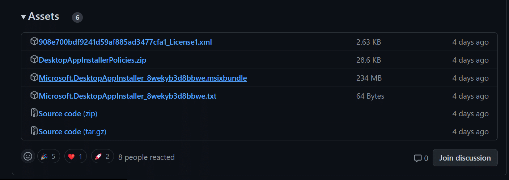
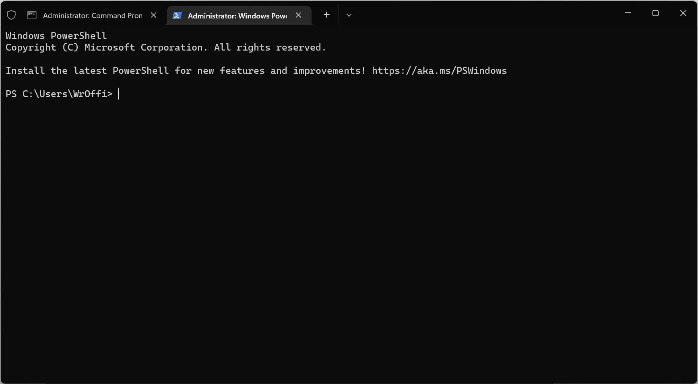
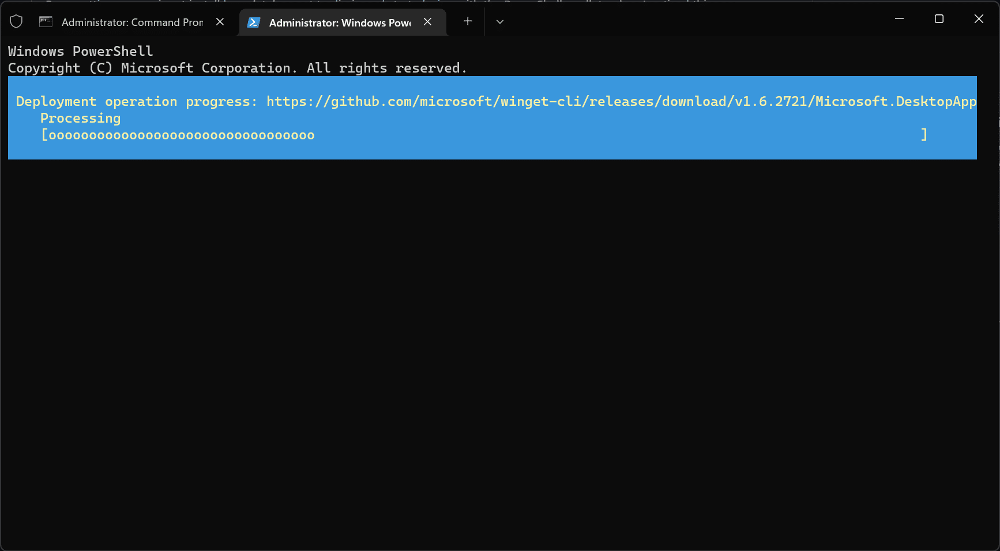

First, open the **[Release Page](https://github.com/microsoft/winget-cli/releases)** of [microsoft/winget-cli](https://github.com/microsoft/winget-cli/) GitHub Repository, grab the latest download link with ".msixbundle" extension, and copy it to your clipboard.

> You just need to copy the download link without downloading it.

Remember, if you're on your production environment, please don't install the releases with "Pre-release" lable. Such releases can be buggy and may encounter unusual errors & issues.



Turn up **Windows Terminal (Administrator)** with **PowerShell**.



Type in the following command. Remember to replace `URI-TO-YOUR-PREV-COPIED LINK` with your copied link.

```powershell
PS C:\Users\WrOffi> Add-AppxPackage -Path 'URI-TO-YOUR-PREV-COPIED LINK'
PS C:\Users\WrOffi> # Example: Add-AppxPackage -Path 'https://github.com/microsoft/winget-cli/releases/download/v1.6.2721/Microsoft.DesktopAppInstaller_8wekyb3d8bbwe.msixbundle'
```

After that, the App Installer will automatically finish the following task.



Finally, you can check the version of winget with the following command.

```powershell
PS C:\Users\WrOffi> winget --version
v1.6.2721
```
