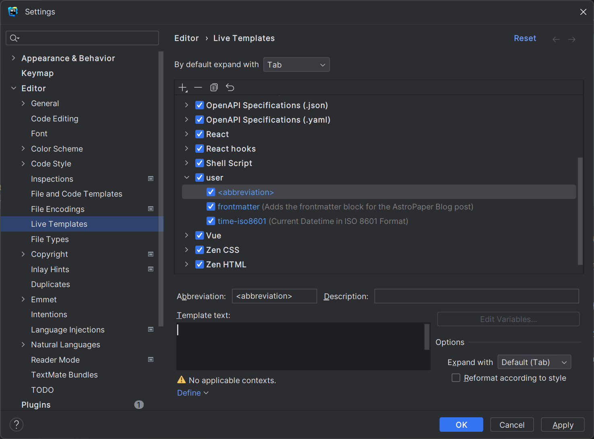
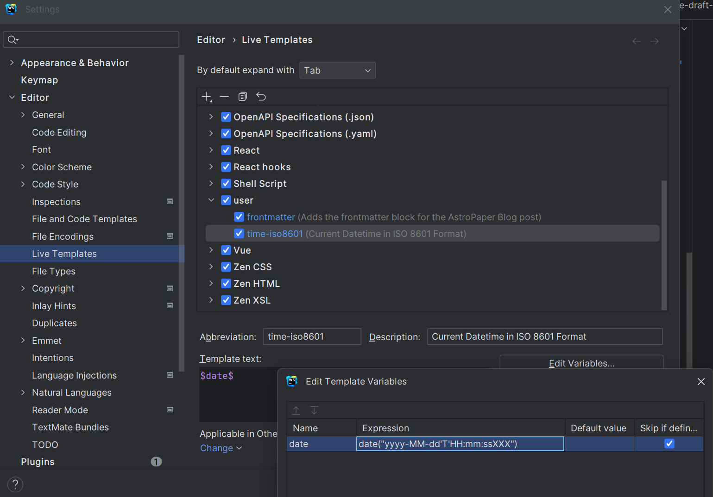
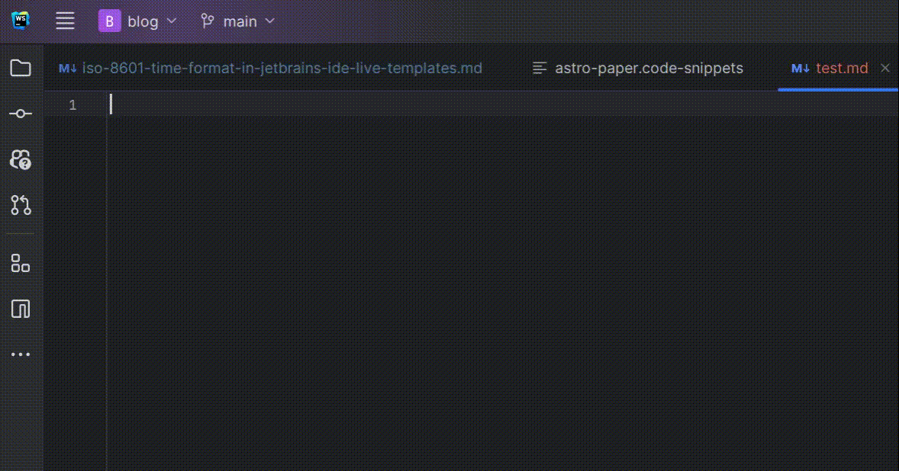
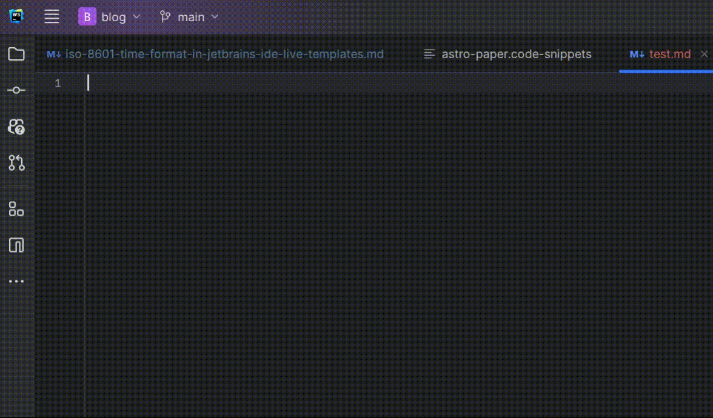

在 Markdown 等静态文件中，手动设置时间一直是一件极其麻烦的事情。尤其是 Astro，它 Markdown 文件中的时间格式必须是 [ISO 8601](https://zh.wikipedia.org/wiki/ISO_8601) 格式。🫠

在此之前，你可能需要前往[在线时间格式转换器](https://streamlet.org/tool/timeformat/)来获取 ISO 8601 格式的时间。然而这种方法极其麻烦，而且当你希望更新时间的时候，你甚至还需要再次打开这个网页，重新复制粘贴...

然而，如果你使用 JetBrains IDE 的话，你可以借助 Live Templates 中的 Variable Expression 自动将当前时间转换为 ISO 8601 格式，无需借助第三方工具。🤔

## 新建 Live Template

打开任意 JetBrains IDE，前往 **Settings** (Ctrl+Alt+S) > **Editor** > **Live Templates**，然后点击 **+** 按钮，选择 **Live Template**。



- 在 Abbreviation (缩写) 处，请填写这个模板名称的简写。在编辑器中输出这个简写后，默认情况下按下 Tab 键即可展开这个模板。本教程中，我使用了 time-iso8601 作为缩写。(毕竟 JetBrains 支持自动填充 🤨)
- _可选: 在 Description (描述) 处，请填写这个模板的描述。这个描述将会在模板列表中显示。_
- 在 Template text (模板文本) 处，请填写这个模板的内容。这里的话，由于只要输出当前时间，所以只需要填写 `$date$` 即可。
- 在 Define 下拉框中，请勾选你希望这个模板在哪些文件类型中生效。由于我只需要在 Markdown 文件中使用该模板，因此我只勾选了 Others。
- _可选: 你也可以在 Options > Expand with... 中选择希望展开这个模板的快捷键。_

## 设置 Variable Expression

点击 Edit Variables，在弹出的窗口中，在 date 变量的 Expression 中填入以下代码

```javascript
date("yyyy-MM-dd'T'HH:mm:ssXXX");
```

_注: 本文所使用的时间格式为 [Astro](https://astro.build/) 所[支持的 ISO 8601 时间格式](https://docs.astro.build/en/guides/content-collections/#working-with-dates-in-the-frontmatter)，可能与其他形式的 ISO 8601 有所不同。_

这个代码使用了 Live Template Variable 的 `date()` 函数，双引号中的内容可以自定义其输出方式。该函数支持以 [SimpleDateFormat](https://docs.oracle.com/javase/7/docs/api/java/text/SimpleDateFormat.html) 设置时间格式，例如: `date("Y-MM-d, E, H:m")` 将会返回 `2020-02-27, Thu, 16:11`。



_如果你想了解 Live Templates 中关于其他变量信息，请参阅 [JetBrains 官方文档](https://www.jetbrains.com/help/idea/template-variables.html)。_

## 效果



除此之外，你也可以把模板应用在其他方面，比如快捷填充 Markdown Frontmatter...



And... that's all! 感谢阅读 😉
