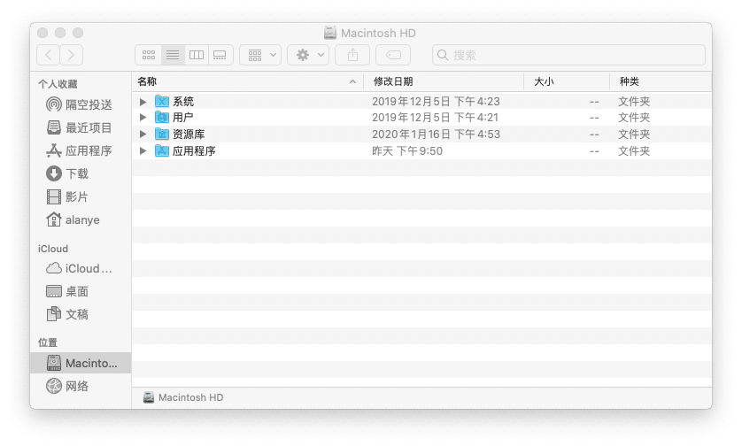
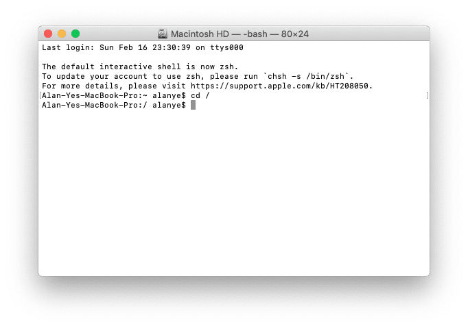
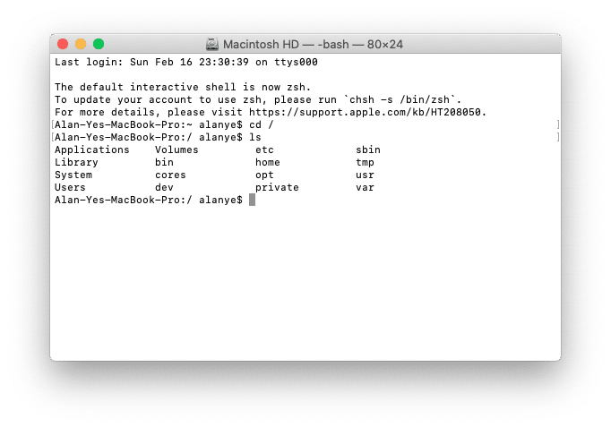
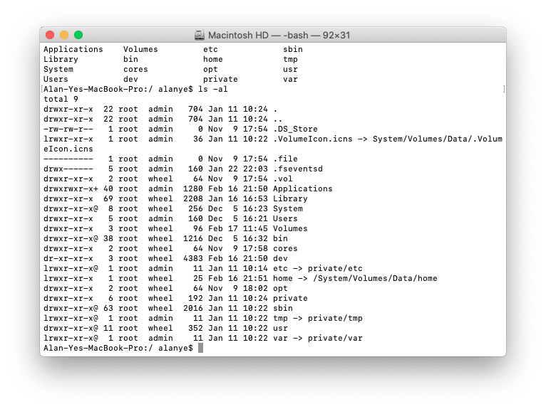

## Table of contents

## 方法一：使用 Finder 访达查看或恢复隐藏文件

- 使用 Finder 打开任意目录（此处以 / 为例）

- 按下 ⇧⌘. （即 Shift + Command + .) 即可显示隐藏文件

- 此时再次按下 ⇧⌘. （即 Shift + Command + .) 即可恢复隐藏文件

## 方法二：使用 Terminal 终端查看隐藏文件

- 打开 Terminal 并进入任意目录（此处再次以 / 为例）

- 运行 ls 以查看当前目录下非隐藏文件

- 运行 ls -al 以查看当前目录下所有文件

